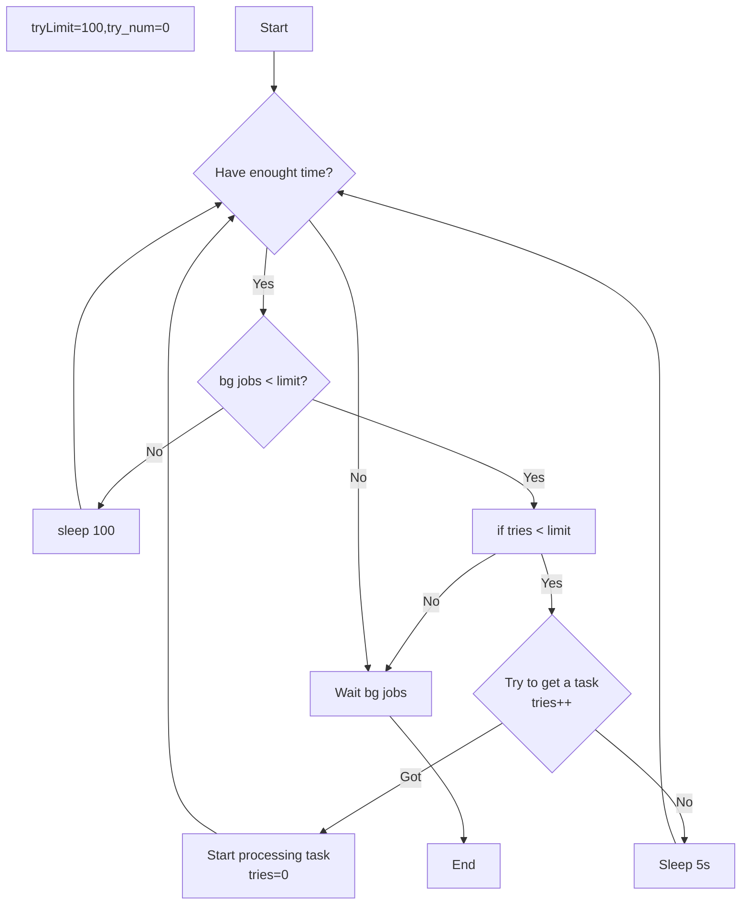

# flock producer/consumer sample

```mermaid
flowchart TB
    Variables[tryLimit=100,try_num=0]
    Start --> CheckEndTime{Have enought time?}
    CheckEndTime -->|Yes| CheckBgNumber{bg jobs < limit?}
    CheckBgNumber -->|No| SleepToWaitForBG[sleep 100] --> CheckEndTime
    CheckBgNumber -->|Yes| CheckTryNum[if tries < limit] --> |Yes| Get{Try to get a task\ntries++}
    Get -->|Got| StartTask[Start processing task\ntries=0]
    StartTask --> CheckEndTime
    Get -->|No| SleepToWaitTask
    CheckTryNum --> |No| Wait
    SleepToWaitTask[Sleep 5s] --> CheckEndTime

    CheckEndTime -->|No| Wait[Wait bg jobs]
    Wait --> End
```
